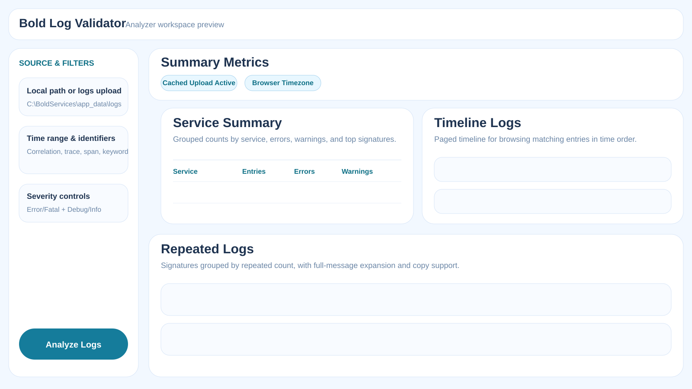
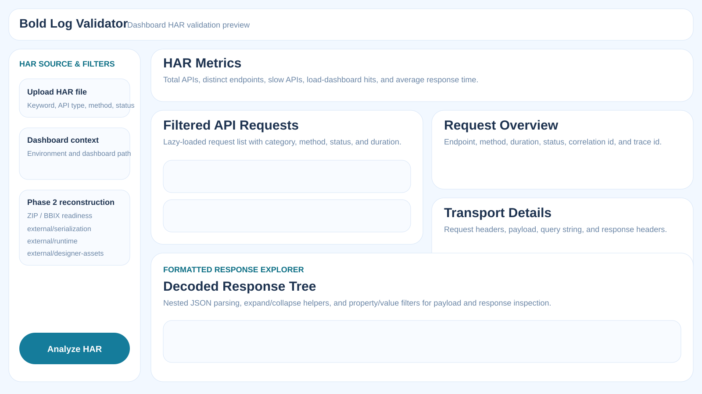
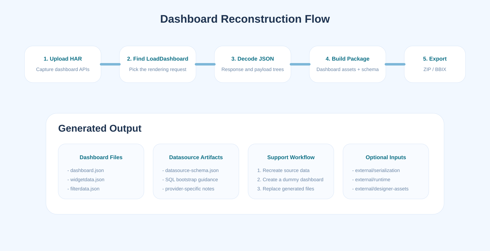

# Bold Log Validator

Bold Log Validator is an ASP.NET Core MVC utility for support, QA, and engineering teams who need to inspect Bold BI service logs and dashboard HAR files without jumping between multiple tools.

It combines three workflows in one app:

1. `Analyzer`: Upload a full logs folder or use a live local log path, then summarize service errors, repeated failures, and timeline entries.
2. `Raw View`: Open raw text log files by service or search across uploaded/cached logs.
3. `Dashboard HAR Validation`: Inspect dashboard API traffic from a HAR file, decode nested JSON payloads, and generate dashboard reconstruction packages.

## Highlights

- Multi-service log folder upload with cached reuse across repeated analysis.
- Local-path log analysis for live rotating environments such as `C:\BoldServices\app_data\logs`.
- Correlation-aware filtering using `correlationId`, `traceId`, `spanId`, and keyword search.
- Browser-timezone filtering while log timestamps are treated as UTC internally.
- Timeline and repeated-log panels with progressive/lazy loading for large investigations.
- HAR inspection with API filtering, request/response transport details, nested JSON decoding, and request-level caching.
- Dashboard reconstruction package generation from `LoadDashboard` HAR responses.

## UI Preview

### Analyzer Workspace



### Dashboard HAR Validation Workspace



### Reconstruction Flow



## How The Application Works

### 1. Analyzer

The analyzer accepts either:

- a local log path such as `C:\BoldServices\app_data\logs`, or
- a browser upload of the complete logs folder or a single service folder.

During analysis it:

- saves uploaded files into `App_Data/CurrentUpload/logs`
- reuses the saved upload session until the next upload replaces it
- parses recognized log files whose names begin with `errors` or `debug`
- correlates entries by service, severity, time range, and trace identifiers
- builds service summaries, repeated-log groups, and timeline views

Important behavior:

- Uploaded logs remain available for re-filtering without re-uploading.
- Timeline and repeated-log panels load in pages to keep large sessions responsive.
- UTC timestamps are converted to the browser timezone for display and filtering.

### 2. Raw View

Raw View is intended for direct text inspection.

It supports:

- service-based file selection
- file-based reading
- keyword search across cached uploaded logs or a local log root
- browsing exact matching lines with file and line references

### 3. Dashboard HAR Validation

HAR validation focuses on dashboard rendering traffic.

It can:

- upload and cache one HAR file
- filter APIs by keyword, category, HTTP method, status family, correlation id, trace id, and time range
- identify `LoadDashboard` requests
- show request headers, payload, query string, and response headers
- decode nested JSON payload/response bodies into a navigable tree
- filter JSON nodes by property/value rules

### 4. Reconstruction Package Generation

When a valid `LoadDashboard` request is available, the app can generate a reconstruction package.

The current package flow can produce:

- `dashboard.json`
- `widgetdata.json`
- `filterdata.json`
- `colorset.json`
- datasource schema metadata
- SQL bootstrap guidance or generated schema scripts, depending on provider support

The reconstruction feature also checks optional external folders used by the app:

- `external/serialization`
- `external/runtime`
- `external/designer-assets`

These are used to improve extraction quality and compatibility when reconstructing dashboard assets from HAR content.

## Project Structure

```text
BoldLogValidator/
|-- App_Data/
|   |-- CurrentUpload/          # active cached log and HAR uploads
|   `-- DataProtectionKeys/     # persisted ASP.NET Core data-protection keys
|-- Controllers/
|   `-- HomeController.cs       # MVC endpoints for analyzer, raw view, HAR validation
|-- Models/
|   |-- AnalysisFilterInput.cs
|   |-- AnalysisResult.cs
|   |-- HarValidationModels.cs
|   `-- RawLogViewModel.cs
|-- Services/
|   |-- ILogAnalysisService.cs
|   `-- LogAnalysisService.cs   # core parsing, caching, grouping, HAR reconstruction
|-- Views/
|   `-- Home/                   # Analyzer, HAR Validation, Raw View views
|-- wwwroot/
|   |-- css/site.css            # dashboard styling
|   `-- js/site.js              # submit flow, lazy loading, copy helpers, JSON explorer
|-- external/
|   |-- serialization/
|   |-- runtime/
|   `-- designer-assets/
`-- Program.cs                  # service registration and form upload limits
```

## Key Endpoints

| Route | Purpose |
|---|---|
| `GET /Home/Index` or `/` | Analyzer landing page |
| `POST /Home/Analyze` | Run log analysis |
| `POST /Home/TimelineEntries` | Lazy-load timeline entries |
| `POST /Home/RepeatedLogEntries` | Lazy-load repeated log groups |
| `GET /Home/RawView` | Open raw log explorer |
| `POST /Home/HarValidation` | Run HAR validation |
| `POST /Home/HarApiEntries` | Lazy-load filtered HAR APIs |
| `POST /Home/HarRequestDetails` | Load selected API details |
| `POST /Home/GenerateHarPackage` | Generate reconstruction ZIP |
| `POST /Home/GenerateHarBbix` | Generate BBIX package when supported |

## Running Locally

### Prerequisites

- .NET SDK 8+
- Windows environment recommended for local log-path usage and IIS-style folder validation

### Start

```powershell
dotnet restore .\BoldLogValidator\BoldLogValidator.csproj
dotnet run --project .\BoldLogValidator\BoldLogValidator.csproj
```

By default the app uses:

- persisted data-protection keys in `App_Data/DataProtectionKeys`
- large form upload limits configured in `Program.cs`
- cached uploads under `App_Data/CurrentUpload`

## Usage Guide

### Analyzer Workflow

1. Open the `Analyzer` tab.
2. Either keep the local log path or upload a logs folder.
3. Optionally add HAR, date range, trace identifiers, or keyword filters.
4. Click `Analyze Logs`.
5. Review:
   - Service Summary
   - Repeated Logs
   - Timeline Logs
6. Open `Raw View` for file-level confirmation.

### HAR Validation Workflow

1. Open the `Dashboard HAR Validation` tab.
2. Upload a HAR file.
3. Click `Analyze HAR`.
4. Choose a filtered API from the left panel.
5. Inspect:
   - Request overview
   - Transport details
   - Decoded payload tree
   - Decoded response tree
6. If a valid `LoadDashboard` request is available, generate the reconstruction package.

## Important Implementation Notes

- Log recognition is based on filenames beginning with `errors` or `debug`, not only `.txt` files.
- Uploaded analyzer logs are intentionally cached and reused until a new upload replaces them.
- HAR request details are cached client-side so reopening the same API is faster.
- The analyzer form submits specifically to `Home/Analyze`; recent fixes hardened this route to avoid accidental posts back to `/`.
- Timeline and repeated-log panels were built with incremental loading to reduce browser lag for large datasets.

## External Dependency Folders

Some advanced reconstruction flows depend on optional local folders:

- `external/serialization`
- `external/runtime`
- `external/designer-assets`

If these folders are populated with the latest assemblies/assets from related Bold BI repos, the app can produce richer reconstruction output and better compatibility for package generation.

## Recommended GitHub Additions

If you are publishing this repository to GitHub, it is helpful to include:

- a sample redacted logs folder structure
- a redacted sample HAR file
- generated reconstruction package examples
- release notes or a `CHANGELOG.md` for major analyzer/HAR validation improvements

## Screenshots

The SVG previews in `docs/images` are lightweight documentation visuals created for the repository. If you want, you can later replace them with real product screenshots captured from your local environment while keeping the same file names:

- `docs/images/analyzer-workspace.svg`
- `docs/images/har-validation-workspace.svg`
- `docs/images/reconstruction-flow.svg`

## License / Internal Usage

This utility appears to be intended for internal engineering and support workflows around Bold BI diagnostics and dashboard reconstruction. Add your preferred repository license or internal-usage note before publishing outside your private source control.
